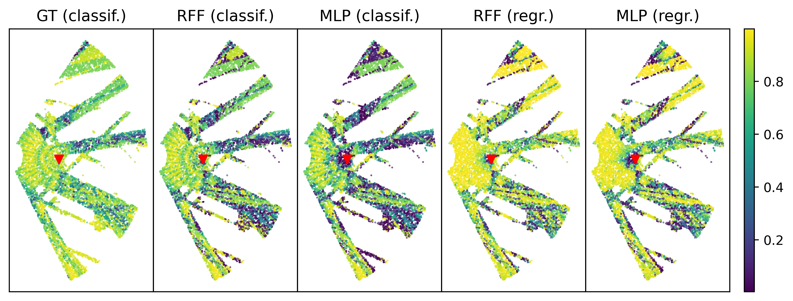

---

##### Download

+ [Paper](https://arxiv.org/pdf/2312.02239)
+ [Slides](slides.pdf)

---

##### Abstract

Channel charting builds a map of the radio environment in an unsupervised way. The obtained chart locations can be seen as low-dimensional compressed versions of channel state information that can be used for a wide variety of applications, including beam prediction. In non-standalone or cell-free systems, chart locations computed at a given base station can be transmitted to several other base stations (possibly operating at different frequency bands) for them to predict which beams to use. This potentially yields a dramatic reduction of the overhead due to channel estimation or beam management, since only the base station performing charting requires channel state information, the others directly predicting the beam from the chart location. In this paper, advanced model-based neural network architectures are proposed for both channel charting and beam prediction. The proposed methods are assessed on realistic synthetic channels, yielding promising results.

---

##### Figure 7: Correlation maps



---

##### Citation

```BibTeX
@INPROCEEDINGS{10476981,
  author={Yassine, Taha and Chatelier, Baptiste and Corlay, Vincent and Crussière, Matthieu and Paquelet, Stéphane and Tirkkonen, Olav and Magoarou, Luc Le},
  booktitle={2023 57th Asilomar Conference on Signals, Systems, and Computers}, 
  title={Model-Based Deep Learning for Beam Prediction Based on a Channel Chart}, 
  year={2023},
  volume={},
  number={},
  pages={1636-1640},
  keywords={Deep learning;Computers;Base stations;Computational modeling;Neural networks;Channel estimation;Computer architecture;Channel charting;Cell-Free network;Dimensionality reduction;MIMO signal processing;Machine learning},
  doi={10.1109/IEEECONF59524.2023.10476981}}

```

---