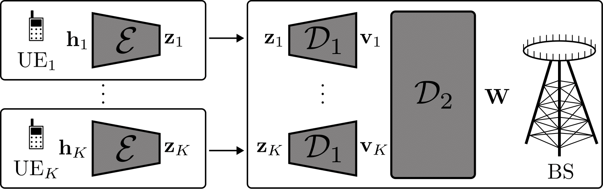

---

##### Download

+ [Paper](https://arxiv.org/pdf/2501.01431)
+ [Slides](slides.pdf)

---

##### Abstract

Reaping the benefits of multi-antenna communication systems in frequency division duplex (FDD) requires channel state information (CSI) reporting from mobile users to the base station (BS). Over the last decades, the amount of CSI to be collected has become very challenging owing to the dramatic increase of the number of antennas at BSs. To mitigate the overhead associated with CSI reporting, compressed CSI techniques have been proposed with the idea of recovering the original CSI at the BS from its compressed version sent by the mobile users. Channel charting is an unsupervised dimensionality reduction method that consists in building a radio-environment map from CSIs. Such a method can be considered in the context of the CSI compression problem, since a chart location is, by definition, a low-dimensional representation of the CSI. In this paper, the performance of channel charting for a task-based CSI compression application is studied. A comparison of the proposed method against baselines on realistic synthetic data is proposed, showing promising results.

---

##### Figure 1: Overview of the proposed CSI compresssion scheme



---

##### Citation

```BibTeX
@INPROCEEDINGS{10942729,
  author={Chatelier, Baptiste and Corlay, Vincent and Crussiére, Matthieu and Le Magoarou, Luc},
  booktitle={2024 58th Asilomar Conference on Signals, Systems, and Computers}, 
  title={CSI Compression Using Channel Charting}, 
  year={2024},
  volume={},
  number={},
  pages={1660-1664},
  keywords={Dimensionality reduction;Computers;Base stations;Communication systems;Buildings;Frequency conversion;Channel state information;Antennas;Synthetic data;Channel charting;Dimensionality reduction;Machine learning;CSI compression},
  doi={10.1109/IEEECONF60004.2024.10942729}}


```

---