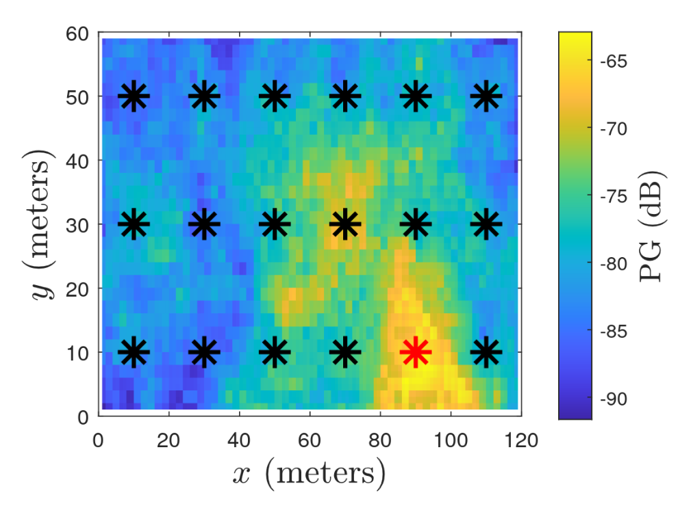

---

##### Download

+ [Paper](https://arxiv.org/pdf/2304.02308)
<!-- + [Slides](slides.pdf) -->

---

##### Abstract

User equipment (UE) positioning accuracy is of paramount importance in current and future communications standard. However, traditional methods tend to perform poorly in non line of sight (NLoS) scenarios. As a result, deep learning is a candidate to enhance the UE positioning accuracy in NLoS environments. In this paper, we study the efficiency of deep learning on the 3GPP indoor factory (InF) statistical channel. More specifically, we analyse the impacts of several key elements on the positioning accuracy, the type of radio data used, the number of base stations (BS), the size of the training dataset, and the generalization ability of a trained model.

---

##### Figure 3: PG map from the perspective of the red BS



---

##### Citation

```BibTeX
@INPROCEEDINGS{10188249,
  author={Chatelier, Baptiste and Corlay, Vincent and Ciochina, Cristina and Coly, Fallou and Guillet, Julien},
  booktitle={2023 Joint European Conference on Networks and Communications & 6G Summit (EuCNC/6G Summit)}, 
  title={Influence of Dataset Parameters on the Performance of Direct UE Positioning via Deep Learning}, 
  year={2023},
  volume={},
  number={},
  pages={126-131},
  doi={10.1109/EuCNC/6GSummit58263.2023.10188249}}
```

---