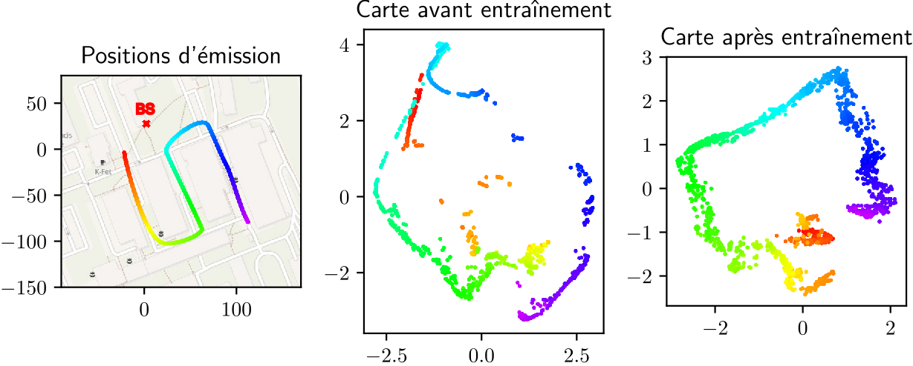

---

##### Download

+ [Paper](https://hal.science/hal-04188506/file/main.pdf)
<!-- + [Slides](slides.pdf) -->

---

##### Abstract

Channel charting is an emerging technique whose aim is to learn a chart from estimated channels, on which spatially close users appear to be close as well. In contrast to conventional localization methods, channel charting is intended to be unsupervised. The proposed method is based on a distance measure adapted to channel vectors. The exploitation of this distance measure allows for the structuring of a neural network known as a model-based network. Initialized intelligently, this network is subsequently trained in triplet mode to improve its performance. Its performance is evaluated on a synthetic channel database generated using the Sionna library.

---

##### Figure 3: Learned charts



---

##### Citation

```BibTeX
@unpublished{yassine:hal-04188506,
  TITLE = {{Cartographie du canal par r{\'e}duction de dimension et r{\'e}seaux triplets}},
  AUTHOR = {Yassine, Taha and Le Magoarou, Luc and Chatelier, Baptiste and Paquelet, St{\'e}phane and Crussi{\`e}re, Matthieu},
  URL = {https://hal.science/hal-04188506},
  NOTE = {working paper or preprint},
  YEAR = {2023},
  MONTH = Aug,
  PDF = {https://hal.science/hal-04188506/file/main.pdf},
  HAL_ID = {hal-04188506},
  HAL_VERSION = {v1},
}
```

---