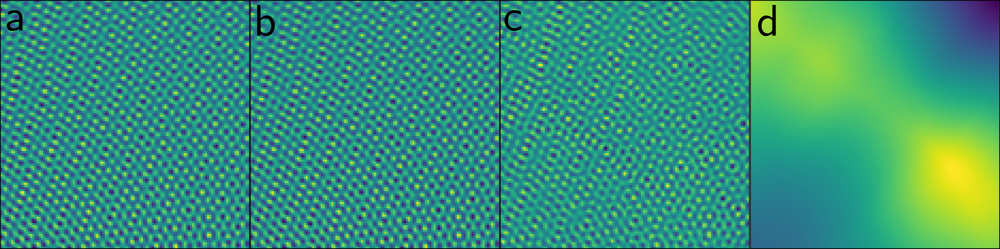

---

##### Download

+ [Paper](https://arxiv.org/pdf/2308.14370)
+ [Slides](slides.pdf)

---

##### Abstract

Modern communication systems rely on accurate channel estimation to achieve efficient and reliable transmission of information. As the communication channel response is highly related to the user’s location, one can use a neural network to map the user’s spatial coordinates to the channel coefficients. However, these latter are rapidly varying as a function of the location, on the order of the wavelength. Classical neural architectures being biased towards learning low frequency functions (spectral bias), such mapping is therefore notably difficult to learn. In order to overcome this limitation, this paper presents a frugal, model-based network that separates the low frequency from the high frequency components of the target mapping function. This yields an hypernetwork architecture where the neural network only learns low frequency sparse coefficients in a dictionary of high frequency components. Simulation results show that the proposed neural network outperforms standard approaches on realistic synthetic data.

---

##### Figure 3: Reconstruction performances



---

##### Citation

```BibTeX
@INPROCEEDINGS{10446774,
  author={Chatelier, Baptiste and Magoarou, Luc Le and Corlay, Vincent and Criissière, Matthieu},
  booktitle={ICASSP 2024 - 2024 IEEE International Conference on Acoustics, Speech and Signal Processing (ICASSP)}, 
  title={Model-Based Learning for Location-to-Channel Mapping}, 
  year={2024},
  volume={},
  number={},
  pages={12836-12840},
  keywords={Three-dimensional displays;Simulation;Neural networks;Signal processing;Performance gain;High frequency;Reliability;Model-based machine learning;Implicit Neural Representations;Spectral bias;Channel estimation},
  doi={10.1109/ICASSP48485.2024.10446774}}
```

---