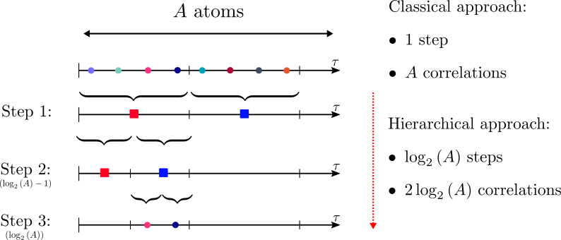

---

##### Download

+ [Paper](https://arxiv.org/pdf/2210.06588)
+ [Slides](slides.pdf)

---

##### Abstract

In modern communication systems, channel state information is of paramount importance to achieve capacity. It is then crucial to accurately estimate the channel. It is possible to perform SISO-OFDM channel estimation using sparse recovery techniques. However, this approach relies on the use of a physical wave propagation model to build a dictionary, which requires perfect knowledge of the system’s parameters. In this paper, an unfolded neural network is used to lighten this constraint. Its architecture, based on a sparse recovery algorithm, allows SISO-OFDM channel estimation even if the system’s parameters are not perfectly known. Indeed, its unsupervised online learning allows to learn the system’s imperfections in order to enhance the estimation performance. The practicality of the proposed method is improved with respect to the state of the art in two aspects, constrained dictionaries are introduced in order to reduce sample complexity and hierarchical search within dictionaries is proposed in order to reduce time complexity. Finally, the performance of the proposed unfolded network is evaluated and compared to several baselines using realistic channel data, showing the great potential of the approach.

---

##### Figure 1: Hierarchical atom search



---

##### Citation

```BibTeX
@INPROCEEDINGS{10278825,
  author={Chatelier, Baptiste and Magoaroul, Luc Le and Redieteab, Getachew},
  booktitle={ICC 2023 - IEEE International Conference on Communications}, 
  title={Efficient Deep Unfolding for SISO-OFDM Channel Estimation}, 
  year={2023},
  volume={},
  number={},
  pages={3450-3455},
  keywords={Adaptation models;Dictionaries;Philosophical considerations;Propagation;Neural networks;Channel estimation;Estimation;Deep Unfolding;Frugal AI;SISO-OFDM channel estimation;Sparse recovery},
  doi={10.1109/ICC45041.2023.10278825}}
```

---