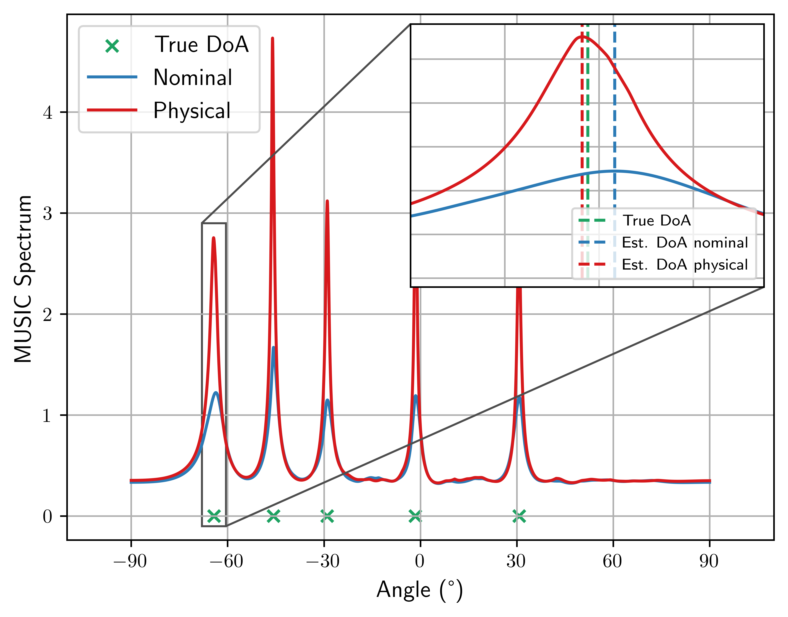

---

##### Download

+ [Paper](https://arxiv.org/pdf/2411.15144)
+ [Slides](slides.pdf)

---

##### Abstract

Direction of arrival (DoA) estimation is a common sensing problem in radar, sonar, audio, and wireless communication systems. It has gained renewed importance with the advent of the integrated sensing and communication paradigm. To fully exploit the potential of such sensing systems, it is crucial to take into account potential hardware impairments that can negatively impact the obtained performance. This study introduces a joint DoA estimation and hardware impairment learning scheme following a model-based approach. Specifically, a differentiable version of the multiple signal classification (MUSIC) algorithm is derived, allowing efficient learning of the considered impairments. The proposed approach supports both supervised and unsupervised learning strategies, showcasing its practical potential. Simulation results indicate that the proposed method successfully learns significant inaccuracies in both antenna locations and complex gains. Additionally, the proposed method outperforms the classical MUSIC algorithm in the DoA estimation task.

---

##### Figure 2: MUSIC performance with and without hardware impairments.



---

##### Citation

```BibTeX
@misc{chatelier24,
      title={Physically Parameterized Differentiable MUSIC for DoA Estimation with Uncalibrated Arrays}, 
      author={Baptiste Chatelier and José Miguel Mateos-Ramos and Vincent Corlay and Christian Häger and Matthieu Crussière and Henk Wymeersch and Luc Le Magoarou},
      year={2024},
      eprint={2411.15144},
      archivePrefix={arXiv},
      primaryClass={eess.SP},
      url={https://arxiv.org/abs/2411.15144}, 
}
```

---