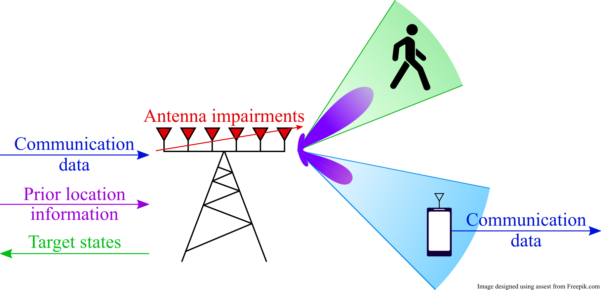

---

##### Download

+ [Paper](https://arxiv.org/pdf/2310.09940)
<!-- + [Slides](slides.pdf) -->

---

##### Abstract

Integrated sensing and communications (ISAC) is envisioned as one of the key enablers of next-generation wireless systems, offering improved hardware, spectral, and energy efficiencies. In this paper, we consider an ISAC transceiver with an impaired uniform linear array that performs single-target detection and position estimation, and multiple-input single-output communications. A differentiable model-based learning approach is considered, which optimizes both the transmitter and the sensing receiver in an end-to-end manner. An unsupervised loss function that enables impairment compensation without the need for labeled data is proposed. Semi-supervised learning strategies are also proposed, which use a combination of small amounts of labeled data and unlabeled data. Our results show that semi-supervised learning can achieve similar performance to supervised learning with 98.8% less required labeled data.

---

##### Figure 1: Considered ISAC scenario.



---

##### Citation

```BibTeX
@misc{mateosramos2023semisupervised,
      title={Semi-Supervised End-to-End Learning for Integrated Sensing and Communications}, 
      author={José Miguel Mateos-Ramos and Baptiste Chatelier and Christian Häger and Musa Furkan Keskin and Luc Le Magoarou and Henk Wymeersch},
      year={2023},
      eprint={2310.09940},
      archivePrefix={arXiv},
      primaryClass={eess.SP}
}
```

---