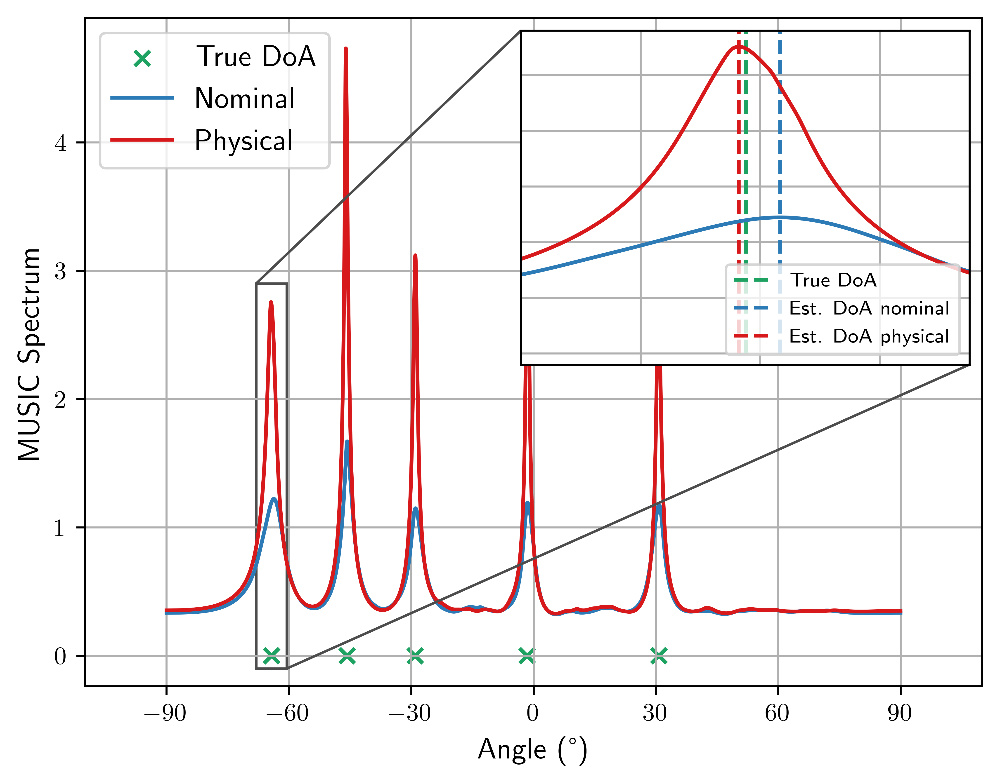

<!-- 
---

##### Download

+ [Paper](https://arxiv.org/pdf/2411.15144)
+ [Slides](slides.pdf)

---

##### Abstract

DoA estimation is a key array-processing task, with existing methods typically relying on accurate knowledge of the array response. Calibration mismatches  can thus severely degrade \ac{doa} recovery, and existing calibration techniques struggle with rapid calibration drifts when only few snapshots are available and no labeled data is provided. We propose a rapid unsupervised online calibration framework that casts drifting array calibration as a state-estimation problem. The proposed method jointly tracks the source directions and calibration parameters over time, exploiting temporal structure rather than recalibrating each time block independently. We develop two state-space formulations: one using the empirical covariance matrix as the observation, and another based on  subspace orthogonality, avoiding  knowledge of the source and noise statistics. Both formulations are solved using few-step iterated extended Kalman filtering, yielding low-complexity recursive calibration from unlabeled measurements. Numerical results show that the proposed dynamic-system-based approach enables accurate DoA estimation under fast calibration variations and limited snapshots.  

---

##### Figure 2: MUSIC performance with and without hardware impairments.



---

##### Citation

```BibTeX
@misc{chatelier24,
      title={Physically Parameterized Differentiable MUSIC for DoA Estimation with Uncalibrated Arrays}, 
      author={Baptiste Chatelier and José Miguel Mateos-Ramos and Vincent Corlay and Christian Häger and Matthieu Crussière and Henk Wymeersch and Luc Le Magoarou},
      year={2024},
      eprint={2411.15144},
      archivePrefix={arXiv},
      primaryClass={eess.SP},
      url={https://arxiv.org/abs/2411.15144}, 
}
```

--- -->