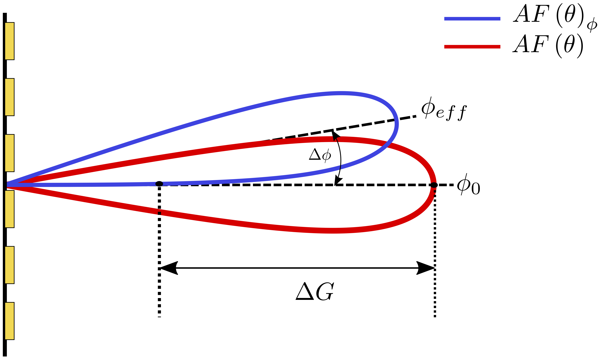

---

##### Download

+ [Paper](https://ieeexplore.ieee.org/document/9771690)
+ [Slides](slides.pdf)

---

##### Abstract

In this paper, we investigate the effects of Phase Noise (PN) on the Array Factor (AF) and beamforming gain of massive MIMO mmWave systems. We present different PN models based on the Local Oscillators (LO) architecture. We then study the impact of those PN models on the Array Factor and beamforming gain. We introduce novel analytical bounds for the asymptotic AF Mean Squared Error (MSE) and asymptotic Gain Loss (GL) due to PN in a MIMO system. We then show the validity of our bounds through simulations. We also provide a statistical study on the underlying probability distributions for both the GL and the effective beam steering direction. The parametric study of the fitted distribution parameters with the number of antennas of the Base Station (BS) provides new overviews on how to model the massive MIMO array factor under PN effects.

---

##### Figure 1: Schematic of the PN effect on the AF



---

##### Citation

```BibTeX
@INPROCEEDINGS{9771690,
  author={Chatelier, Baptiste and Crussi&#x00E8;re, Matthieu},
  booktitle={2022 IEEE Wireless Communications and Networking Conference (WCNC)}, 
  title={On the Impact of Phase Noise on Beamforming Performance for mmWave Massive MIMO Systems}, 
  year={2022},
  volume={},
  number={},
  pages={1563-1568},
  doi={10.1109/WCNC51071.2022.9771690}}
```

---