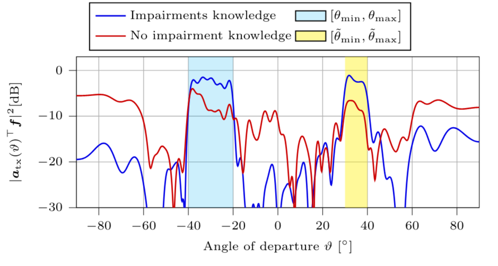

---

##### Download

+ [Paper](https://arxiv.org/pdf/2604.00806)

---

##### Abstract

In this work, we consider end-to-end calibration of an integrated sensing and communication (ISAC) base station (BS) under gain-phase and antenna displacement impairments without collecting signals from predefined positions (labeled data). We consider a BS with two impaired uniform linear arrays used for simultaneous multi-target sensing and communication with a user equipment (UE) leveraging orthogonal frequency-division multiplexing signals. The main contribution is the design of a framework that can compensate for the impairments without labeled data and considering coherent receive signals. We harness a differentiable precoder based on the maximum array response in an angular direction at the transmitter and the orthogonal matching pursuit (OMP) algorithm at the sensing receiver. We propose an ISAC loss as a combination of sensing and communication losses that provides a trade-off between the two functionalities. We compare two sensing objective alternatives: (i) maximize the maximum response of the angle-delay map of the targets or (ii) minimize the norm of the residual signal at the output of the OMP algorithm after all estimated targets have been removed. The communication objective maximizes the energy of the received signal at the UE.  Additionally, our framework leverages an approximation of the channel gradient that avoids the impractical knowledge of the gradient of the channel. Our results show that the proposed method performs closely to using labeled data and knowledge of the channel gradient in terms of sensing position estimation and communication symbol error rate. When comparing the two sensing losses, minimizing the norm of the OMP residual yields significantly better sensing position estimation with slightly increased complexity.

---

##### Figure 1: Precoder response under matched and hardware impairments



---

##### Citation

```BibTeX
@misc{mateosramos2026unsupervisedendtoendarraycalibration,
      title={Unsupervised End-to-End Array Calibration for Multi-Target Integrated Sensing and Communication}, 
      author={José Miguel Mateos-Ramos and Baptiste Chatelier and Luc Le Magoarou and Nir Shlezinger and Henk Wymeersch and Christian Häger},
      year={2026},
      eprint={2604.00806},
      archivePrefix={arXiv},
      primaryClass={eess.SP},
      url={https://arxiv.org/abs/2604.00806}, 
}

```

---