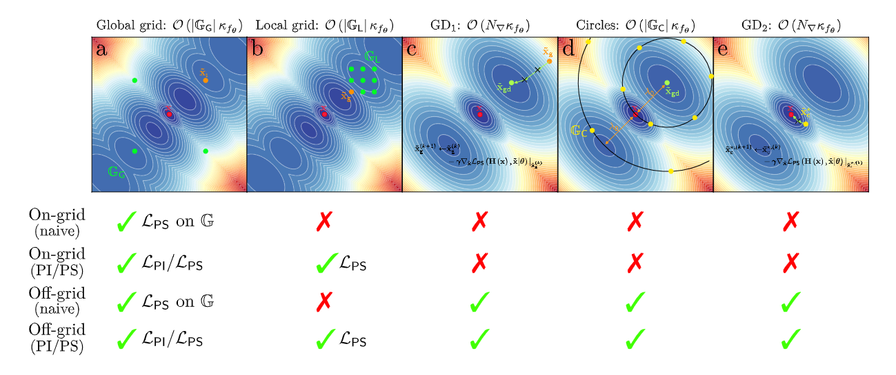

---

##### Download

+ [Paper](https://arxiv.org/pdf/2506.06387)

---

##### Abstract

The increasing deployment of large antenna arrays at base stations has significantly improved the spatial resolution and localization accuracy of radio-localization methods. However, traditional signal processing techniques struggle in complex radio environments, particularly in scenarios dominated by non line of sight (NLoS) propagation paths, resulting in degraded localization accuracy. Recent developments in machine learning have facilitated the development of machine learning-assisted localization techniques, enhancing localization accuracy in complex radio environments. However, these methods often involve substantial computational complexity during both the training and inference phases. This work extends the well-established fingerprinting-based localization framework by simultaneously reducing its memory requirements and improving its accuracy. Specifically, a model-based neural network is used to learn the location-to-channel mapping, and then serves as a generative neural channel model. This generative model augments the fingerprinting comparison dictionary while reducing the memory requirements. The proposed method outperforms fingerprinting baselines by achieving sub-wavelength localization accuracy, even in NLoS environments. Remarkably, it offers an improvement by several orders of magnitude in localization accuracy, while simultaneously reducing memory requirements by an order of magnitude compared to classical fingerprinting methods.

---

##### Figure 5. Illustration of the proposed localization scheme steps.



---

##### Citation

```BibTeX
@misc{chatelier2025modelbasedneuraldataaugmentation,
      title={Model-based Neural Data Augmentation for sub-wavelength Radio Localization}, 
      author={Baptiste Chatelier and Vincent Corlay and Musa Furkan Keskin and Matthieu Crussière and Henk Wymeersch and Luc Le Magoarou},
      year={2025},
      eprint={2506.06387},
      archivePrefix={arXiv},
      primaryClass={eess.SP},
      url={https://arxiv.org/abs/2506.06387}, 
}

```

---