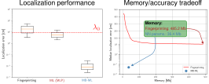

+++
title = "**PhD**"
menu = "PhD"
weight = 5
+++

## *Model-based learning for high-dimensional wireless systems*

Defended January 2026, INSA Rennes · [Manuscript (PDF)](/_PhD_manuscript/PhD_manuscrit_CHATELIER.pdf) · [Defense slides](/_PhD_defense/slides.html) · [theses.fr](https://theses.fr/2026ISAR0002)

My PhD work focused on bridging model-based methods (signal processing) and learning methods (machine learning) through the model-based machine learning paradigm, applied to wireless communication problems.

The thesis was funded by Mitsubishi Electric R&D Centre Europe ([MERCE](https://www.mitsubishielectric-rce.eu/)) and supervised by [Luc Le Magoarou](https://luclemagoarou.netlify.app/), [Vincent Corlay](https://www.linkedin.com/in/vincent-corlay-b48001108/) and [Matthieu Crussière](https://www.linkedin.com/in/matthieu-crussiere-06646933/).

